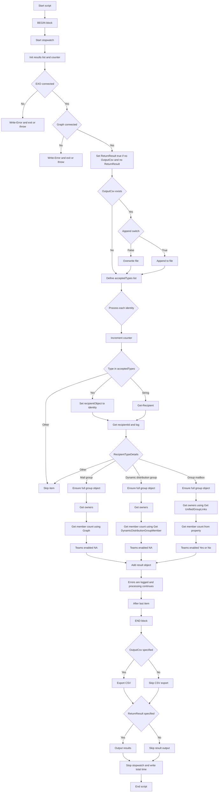

# Get-EXOGroupMemberCount.ps1

- [Overview](#overview)
- [Requirements](#requirements)
- [Features](#features)
- [Parameters](#parameters)
- [Output](#output)
- [Usage Examples](#usage-examples)
  - [1. Return results to screen](#1-return-results-to-screen)
  - [2. Export results to CSV](#2-export-results-to-csv)
  - [3. Append results to a new or existing CSV](#3-append-results-to-a-new-or-existing-csv)
  - [4. Multiple groups via pipeline](#4-multiple-groups-via-pipeline)
- [Script Flow Overview](#script-flow-overview)
- [Script Architecture Overview](#script-architecture-overview)
- [Notes](#notes)

## Overview

`Get-EXOGroupMemberCount.ps1` is a PowerShell script for retrieving member counts and owner details for Exchange Online groups, including:

- Distribution Groups
- Dynamic Distribution Groups
- Microsoft 365 Groups (Unified Groups)

It supports exporting results to CSV or returning them directly in the console.

## Requirements

- **PowerShell**: 7.3 or later (recommended), Windows PowerShell 5.1
- **Modules**:
  - [ExchangeOnlineManagement](https://www.powershellgallery.com/packages/ExchangeOnlineManagement) 3.7.0 or later.
  - [Microsoft Graph PowerShell SDK](https://www.powershellgallery.com/packages/Microsoft.Graph)
- An active **Exchange Online PowerShell session** (via `Connect-ExchangeOnline`)
- An active **Microsoft Graph PowerShell session** (via `Connect-MgGraph`)

## Features

- Retrieves group type, primary SMTP address, member count, and Teams-enabled status.
- Supports pipeline input for multiple groups.
- Can output to both CSV and console.
- Validates Exchange Online and Microsoft Graph connections before processing.

## Parameters

| Parameter       | Type                    | Mandatory | Description                                                                                         |
| --------------- | ----------------------- | --------- | --------------------------------------------------------------------------------------------------- |
| `-Identity`     | String / Pipeline input | Yes       | One or more group identities (name, alias, SMTP address, GUID, etc.). Accepts pipeline input.       |
| `-OutputCsv`    | String                  | No        | Path to a CSV file to export results. **If the file exists, it will be overwritten.**               |
| `-Append`       | Switch                  | No        | Appends the output to the output CSV file instead of overwriting it.                                |
| `-ReturnResult` | Switch                  | No        | Returns the result objects to the pipeline. Enabled automatically if no output method is specified. |

---

## Output

The script returns or exports objects with the following properties:

| Property       | Description                                                                     |
| -------------- | ------------------------------------------------------------------------------- |
| `GroupName`    | Display name of the group                                                       |
| `GroupEmail`   | Primary SMTP address                                                            |
| `GroupType`    | Recipient type details (e.g., `GroupMailbox`, `MailUniversalDistributionGroup`) |
| `TeamsEnabled` | `Yes` / `No` for Teams-enabled Microsoft 365 Groups, or `N/A` for other types   |
| `Owners`       | Owner(s) of the group.                                                          |
| `MemberCount`  | Number of members in the group                                                  |

---

## Usage Examples

### 1. Return results to screen

```powershell
.\Get-EXOGroupMemberCount.ps1 -Identity "Marketing Team"
```

### 2. Export results to CSV

```powershell
.\Get-EXOGroupMemberCount.ps1 -Identity "Marketing Team" -OutputCsv "C:\Reports\GroupMembers.csv"
```

### 3. Append results to a new or existing CSV

```PowerShell
.\Get-EXOGroupMemberCount.ps1 -Identity "Marketing Team" -OutputCsv "C:\Reports\GroupMembers.csv" -Append
```

### 4. Multiple groups via pipeline

```powershell
"Marketing Team","Sales Team" | .\Get-EXOGroupMemberCount.ps1 -OutputCsv ".\Groups.csv"
```

---

## Script Flow Overview

```text
+---------------------------------------------------------------+
|                  Get-EXOGroupMemberCountGraph.ps1             |
+---------------------------------------------------------------+
| Parameters: Identity (req), OutputCsv, Append, ReturnResult   |
+---------------------------------------------------------------+
        |
        v
+---------------------------+
| BEGIN block               |
+---------------------------+
| Start stopwatch           |
| Init results list, counter|
|                           |
| Check EXO connection      |
|   ├─ No → Error + exit    |
|   └─ Yes → Continue       |
| Check Graph connection    |
|   ├─ No → Error + exit    |
|   └─ Yes → Continue       |
|                           |
| If no OutputCsv & no      |
| ReturnResult → set        |
| ReturnResult=$true        |
|                           |
| If OutputCsv exists:      |
|   ├─ Append=$false →      |
|       Overwrite file      |
|   └─ Append=$true →       |
|       Append to file      |
|                           |
| Define acceptedTypes[]    |
+---------------------------+
        |
        v
+---------------------------+
| PROCESS block (per item)  |
+---------------------------+
| counter++                 |
| Determine $objTypeName    |
| switch($objTypeName):     |
|   ├─ In acceptedTypes →   |
|         $recipientObject=Identity
|   ├─ "System.String" →    |
|         Get-Recipient     |
|   └─ Else → continue      |
|                           |
| Get $recipientId, log info|
|                           |
| switch($RecipientTypeDetails):
|   ├─ Mail*Group ----------+
|   |   Ensure full groupObj|
|   |   Get owners          |
|   |   Get member count    |
|   |   TeamsEnabled = N/A  |
|   +-----------------------+
|   ├─ DynamicDistribution -+
|   |   Ensure full groupObj|
|   |   Get owners          |
|   |   Get member count    |
|   |   TeamsEnabled = N/A  |
|   +-----------------------+
|   ├─ GroupMailbox --------+
|   |   Ensure full groupObj|
|   |   Get owners          |
|   |   Get member count    |
|   |   TeamsEnabled = Yes/No
|   +-----------------------+
|   └─ Else → continue      |
|                           |
| Add result object to list |
| On error → Write-Error &  |
| continue                  |
+---------------------------+
        |
        v
+---------------------------+
| END block                 |
+---------------------------+
| If OutputCsv → Export-CSV |
| If ReturnResult → output  |
| Stop stopwatch            |
| Verbose: total time       |
+---------------------------+

```

---

## Script Architecture Overview



## Notes

- The script will exit early if not connected to Exchange Online.
- If neither `-OutputCsv` nor `-ReturnResult` is provided, `-ReturnResult` will be enabled by default.
