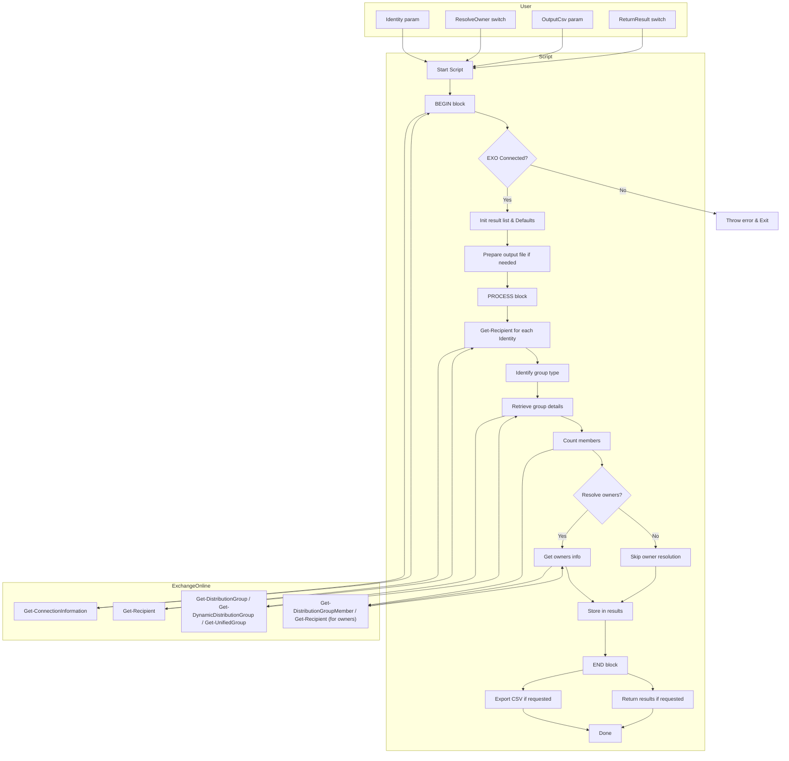

# Get-EXOGroupMemberCount.ps1

- [Overview](#overview)
- [Requirements](#requirements)
- [Features](#features)
- [Parameters](#parameters)
- [Output](#output)
- [Usage Examples](#usage-examples)
  - [1. Return results to screen](#1-return-results-to-screen)
  - [2. Export results to CSV](#2-export-results-to-csv)
  - [3. Resolve owner names](#3-resolve-owner-names)
  - [4. Multiple groups via pipeline](#4-multiple-groups-via-pipeline)
- [Script Flow Overview](#script-flow-overview)
- [Script Architecture Overview](#script-architecture-overview)
- [Notes](#notes)

## Overview

`Get-EXOGroupMemberCount.ps1` is a PowerShell script for retrieving member counts and owner details for Exchange Online groups, including:

- Distribution Groups
- Dynamic Distribution Groups
- Microsoft 365 Groups (Unified Groups)

It supports exporting results to CSV or returning them directly in the console.

## Requirements

- **PowerShell**: 7.3 or later (recommended), Windows PowerShell 5.1
- **Modules**: [ExchangeOnlineManagement](https://www.powershellgallery.com/packages/ExchangeOnlineManagement) 3.7.0 or later.
- An active **Exchange Online PowerShell session** (via `Connect-ExchangeOnline`)

## Features

- Retrieves group type, primary SMTP address, member count, and Teams-enabled status.
- Optionally resolves owner details.
- Supports pipeline input for multiple groups.
- Can output to both CSV and console.
- Validates Exchange Online connection before processing.

## Parameters

| Parameter       | Type                    | Mandatory | Description                                                                                           |
| --------------- | ----------------------- | --------- | ----------------------------------------------------------------------------------------------------- |
| `-Identity`     | String / Pipeline input | Yes       | One or more group identities (name, alias, SMTP address, GUID, etc.). Accepts pipeline input.         |
| `-ResolveOwner` | Switch                  | No        | If specified, resolves the **ManagedBy** property to user-friendly identifiers (e.g., WindowsLiveId). |
| `-OutputCsv`    | String                  | No        | Path to a CSV file to export results. **If the file exists, it will be overwritten.**                     |
| `-ReturnResult` | Switch                  | No        | Returns the result objects to the pipeline. Enabled automatically if no output method is specified.   |

---

## Output

The script returns or exports objects with the following properties:

| Property       | Description                                                                     |
| -------------- | ------------------------------------------------------------------------------- |
| `GroupName`    | Display name of the group                                                       |
| `GroupEmail`   | Primary SMTP address                                                            |
| `GroupType`    | Recipient type details (e.g., `GroupMailbox`, `MailUniversalDistributionGroup`) |
| `TeamsEnabled` | `Yes` / `No` for Teams-enabled Microsoft 365 Groups, or `N/A` for other types   |
| `Owners`       | Owner(s) of the group (resolved if `-ResolveOwner` is used)                     |
| `MemberCount`  | Number of members in the group                                                  |

---

## Usage Examples

### 1. Return results to screen

```powershell
.\Get-EXOGroupMemberCount.ps1 -Identity "Marketing Team"
```

### 2. Export results to CSV

```powershell
.\Get-EXOGroupMemberCount.ps1 -Identity "Marketing Team" -OutputCsv "C:\Reports\GroupMembers.csv"
```

### 3. Resolve owner names

```PowerShell
.\Get-EXOGroupMemberCount.ps1 -Identity "Marketing Team" -ResolveOwner
```

### 4. Multiple groups via pipeline

```powershell
"Marketing Team","Sales Team" | .\Get-EXOGroupMemberCount.ps1 -ResolveOwner -OutputCsv ".\Groups.csv"
```

---

## Script Flow Overview

```text
+--------------------------+
|   Start Script           |
+--------------------------+
           |
           v
+--------------------------+
| BEGIN block              |
| - Verify EXO connection  |
| - Initialize result list |
| - Handle defaults        |
| - Prepare output file    |
+--------------------------+
           |
           v
+--------------------------+
| PROCESS block            |
| - For each Identity:     |
|   * Get-Recipient        |
|   * Identify group type  |
|   * Get group details    |
|   * Count members        |
|   * Resolve owners (opt) |
|   * Store in results     |
+--------------------------+
           |
           v
+--------------------------+
| END block                |
| - Export to CSV (if set) |
| - Return results (if set)|
+--------------------------+
           |
           v
+--------------------------+
|         Done             |
+--------------------------+

```

---

## Script Architecture Overview



## Notes

- The script will exit early if not connected to Exchange Online.
- If neither `-OutputCsv` nor `-ReturnResult` is provided, `-ReturnResult` will be enabled by default.
