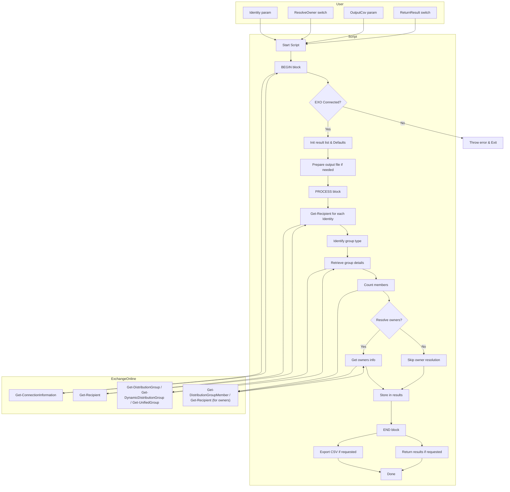

# Get-EXOGroupMemberCount.ps1

## Overview

`Get-EXOGroupMemberCount.ps1` is a PowerShell script for retrieving member counts and owner details for Exchange Online groups, including:

- Distribution Groups
- Dynamic Distribution Groups
- Microsoft 365 Groups (Unified Groups)

It supports exporting results to CSV or returning them directly in the console.

## Requirements

- PowerShell 7+
- ExchangeOnlineManagement module
- Exchange Online administrative permissions

## Features

- Retrieves group type, primary SMTP address, member count, and Teams-enabled status.
- Optionally resolves owner details.
- Supports pipeline input for multiple groups.
- Can output to both CSV and console.
- Validates Exchange Online connection before processing.

## Usage

```powershell
# Basic usage with console output
./Get-EXOGroupMemberCount.ps1 -Identity "GroupName" -ReturnResult

# Export results to CSV
./Get-EXOGroupMemberCount.ps1 -Identity "GroupName" -OutputCsv "output.csv"

# Pipeline usage with owner resolution
"Group1", "Group2" | ./Get-EXOGroupMemberCount.ps1 -ResolveOwner -OutputCsv "output.csv"
```

## Parameters

- **Identity** *(Mandatory)*: Identity of the group to retrieve information for.
- **ResolveOwner** *(Switch)*: Retrieves the full owner list for the group.
- **OutputCsv** *(String)*: Path to export results to CSV.
- **ReturnResult** *(Switch)*: Returns results to console.

## Script Architecture Overview



## Notes

- The script will exit early if not connected to Exchange Online.
- If neither `-OutputCsv` nor `-ReturnResult` is provided, `-ReturnResult` will be enabled by default.
